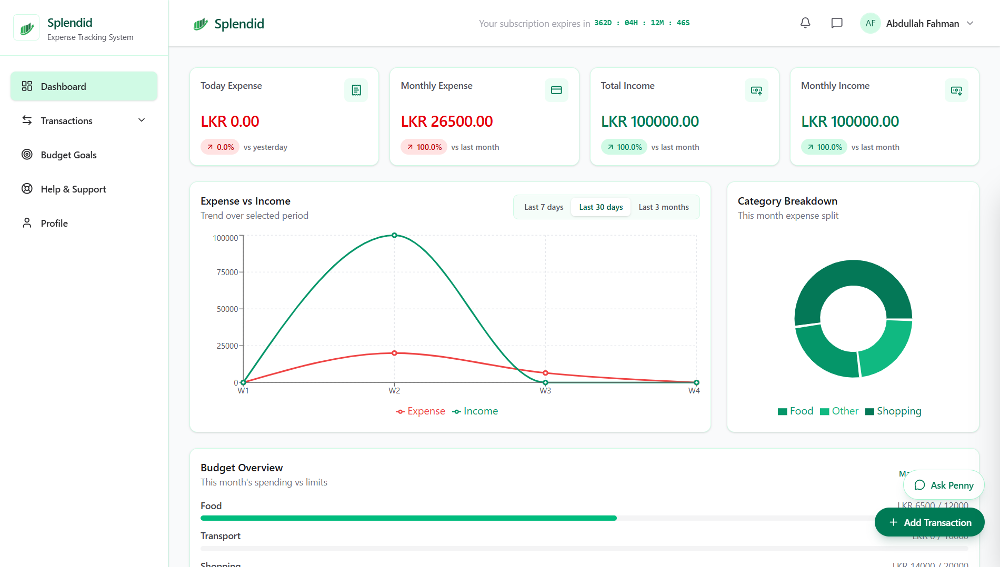
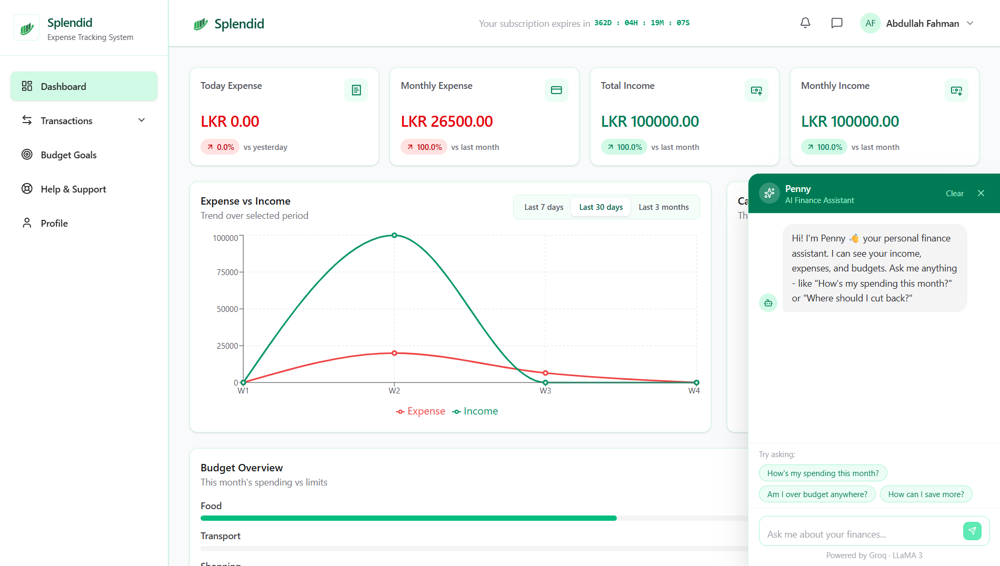

# 💸 Splendid - Enterprise SaaS Expense Tracker



**Splendid** is a full-stack, enterprise-grade SaaS financial platform designed to help users track expenses, manage budgets, and analyze spending habits. Built with a robust **Java 21 Spring Boot** backend and a responsive **React 19 / Tailwind v4** frontend, the platform features OAuth2, secure payment gateways, a built-in AI Financial Assistant, and a complete role-based support ticketing system.

🌐 **Live Production App:** [https://splendid.moonfleet.lk](https://splendid.moonfleet.lk)

---

## ✨ Key Features

*   **🔒 Authentication & Security:** 
    *   Custom JWT-based authentication with strict route guarding.
    *   Seamless **Google OAuth2 Single Sign-On** integration.
    *   Role-Based Access Control (RBAC) separating Standard Users from Admins.
*   **💳 SaaS Subscriptions & Payments:** 
    *   Integrated with **PayHere** payment gateway.
    *   Secure backend webhook verification using MD5 hashing to instantly activate subscriptions.
    *   Subscription expiration countdowns and strict feature-locking for expired accounts.
*   **🤖 Penny - The AI Financial Assistant:**
    *   Context-aware AI chatbot powered by Groq (`openai/gpt-oss-20b`).
    *   Analyzes the user's specific income, expenses, and budgets to provide tailored financial advice.
    *   *Security Note:* API keys are secured server-side via a custom proxy controller, never exposed to the client.
*   **🎫 Two-Way Support Ticketing & Notifications:**
    *   Users can open support tickets and converse with admins via a live-threaded chat UI.
    *   Admins can manage tickets, update statuses, and push **System Broadcasts** to all users.
    *   Live-polling Notification Bell alerts users of replies or broadcasts instantly.
    *   Automated transactional emails (via Resend) for account verification, password resets, and ticket updates.
*   **📊 Interactive Dashboards:**
    *   Real-time financial charts and data visualization using **Recharts**.
    *   Dedicated Admin Panel for tracking platform profits, managing users, and overseeing active subscriptions.

---

## 📸 Platform Previews

| User Dashboard & Analytics | AI Financial Assistant ("Penny") | Secure Payment Gateway |
| :---: | :---: | :---: |
|  |  |  |

---

## 🛠️ Technical Stack

### Backend (Spring Boot)
*   **Framework:** Java 21, Spring Boot 3.5.0
*   **Database:** MySQL 8.0, Spring Data JPA (Hibernate)
*   **Security:** Spring Security, JWT (`jjwt`), Google API Client
*   **Integrations:** Cloudinary (Media), Resend/JavaMailSender (Emails), PayHere (Payments), Groq (AI)
*   **Documentation:** Swagger UI / OpenAPI v3

### Frontend (React/Vite)
*   **Framework:** React 19, Vite 8
*   **Styling:** Tailwind CSS v4, Lucide React Icons
*   **State & Routing:** Redux Toolkit, React Context, React Router DOM v7
*   **Networking:** Axios (with Bearer Token Interceptors)
*   **Data Viz:** Recharts

### DevOps & Infrastructure
*   **Containerization:** Docker & Docker Compose
*   **CI/CD:** GitHub Actions (Automated build, push to DockerHub, and SSH deployment to VPS)
*   **Hosting:** Contabo VPS managed via aaPanel (NGINX Reverse Proxy)
*   **Test the Subscription Flow: The app is currently in Sandbox mode! Create an account and upgrade using the PayHere Test Visa: 4916217501611292 (Any future expiry & CVV) to see the instant webhook activation in action.

---

## 🚀 Local Development Setup

### Prerequisites
*   Java 21+
*   Node.js 20+
*   MySQL 8.0+
*   Docker (optional, for running the full stack locally)

### 1. Database Setup
Create a MySQL database named `splendid_db`.

### 2. Backend Setup
Navigate to the `splendid-backend` directory, configure your `application.properties` with your database credentials and API keys (Cloudinary, Resend, Groq, PayHere), and run:
```bash
./mvnw spring-boot:run
